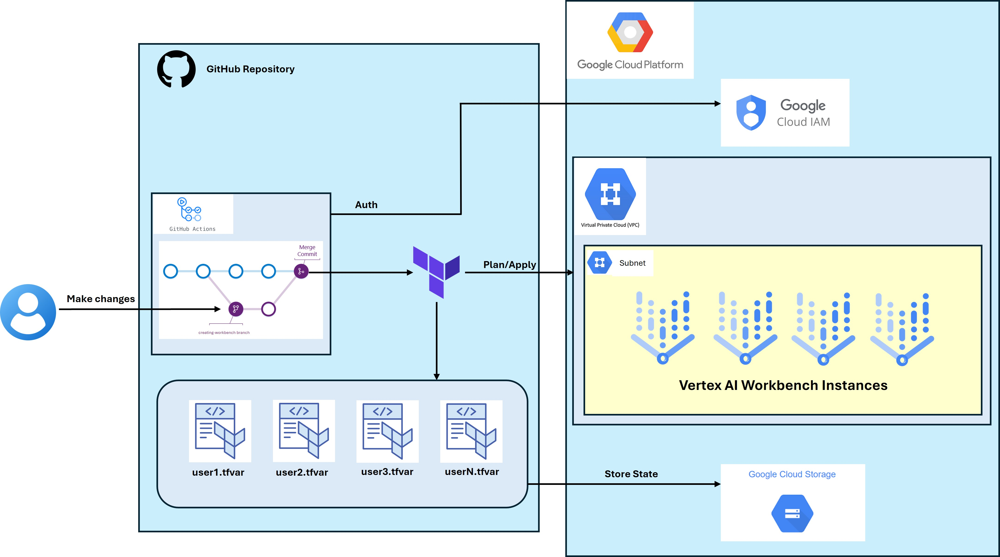

# Creating Vertex AI Workbench Instance automatically with Terraform and Github Actions

## Objective
- Use Terraform to create a Vertex AI Workbench instance for 10 users.
- Each instance will be specified by an user (specified with user email).
- Automate the instance creation steps using Github Actions.

## Infrastructure

## Key Components
### Vertex AI Workbench Instances
- Instancs number: 10.
- Each instance is allocated to a specific user according to their email address.

### Terraform
- Centralized Terraform scripts are used to define the networking infrastructure and set up the Vertex AI Workbench instances.
- Each user will have an individual .tfvars file containing user email and some other attributes to customize each instance.
- Terraform state management: utilize `terraform workspace` to create distinct workspaces and corresponding state files for each user.

### Github Actions
- Automate creation process with Github Actions
- Trigger the workflow when the `pull request` event become `closed` on the `main` branch.

## Advantages
- **Consistency**: Standardize the workbench creation process for all users, reducing human errors.
- **Efficiency**: Create workbench instances using GitHub Actions and Terraform, saving time and effort compared to manual provisioning.
- **Flexibility**: Easily scale the workbench creation for multiple users by adding new `.tfvars` files while maintaining separate workspaces and state files to prevent conflicts.
- **Version Control and Collaboration**: Utilize version control (GitHub) to track changes, facilitate collaboration through pull requests and reviews, and implement a CI/CD pipeline with GitHub Actions for automated testing and deployment.

## Limitations
- Scalability concerns arise as managing numerous `.tfvars` files and GitHub Actions workflows can become cumbersome with a growing user base.
- Resource management is challenged by quota limits, as consolidating all instances into one project may not be feasible due to resource constraints.
- Maintenance complexities arise from managing multiple Terraform state files, particularly during updates or rollbacks.
